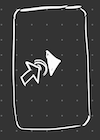

# Beats from Outer Space


Beats from Outer Space is a 2.5D, low poly, Top Down Space Shooter with a Mobile first approach in mind.

## Controls

Controls are intended to be "single finger" only utilizing gestures for the different movements and attacks.
Following Controls are already implemented:

- When touching the screen the game starts:
  - Time runs normally
  - Player shoots automatically
  - Music plays unaltered

    

- Lifting the finger from the screen causes:
  - Game time slows down drastically
  - Player stops shooting
  - music pitch lowers causing a slow down effect

    

- Dragging the finger will:
  - let the player ship move towards a point slightly in front of the players finger
  - the ship movement does have a max velocity and will trail behind the finger if the player is too fast
  - max velocity is a prerequisite to perform a maneuver

- Currently the only supported maneuver is the "parry":
  - If a enemy is loading a special attack the player may risk to swish their finger towards, close to the enemy and immediately back

    

  - This causes the player to spin and hit the enemy causing a lot of damage while receiving none

    

  - If the enemy health reaches zero after the parry the enemy will explode catapulting debris around harming nearby enemies

    

  - This debris may cause other ships to explode causing a chain reaction

## Balancing

For the future some aspects need to be addressed:

- Parry:
  - timing for enemy loading and reaching this enemy must be tested and balanced
  - Considering enemy health > parry damage with some visual cue to make the player strategize when to use the parry

## Music and Effects

Music shall be an integral part of the game.
Music pitch and also single instruments shall be effected by the player and enemy movement and attacks.

## Contribute

- Download the Godot Engine from [here](https://godotengine.org)
- Try out Godot following the getting started page in the [Godot Docs](https://docs.godotengine.org/en/stable/getting_started/step_by_step/index.html)
- Clone or Fork this repository

    ```bash
        git clone https://github.com/lombardi-antonio/beats-from-outer-space.git path/to/desired/folder
    ```

- When starting Godot click on ```Scan``` and navigate to the project folder
- You should be able to run the project now and start familiarize yourself with the folder structure

### Building from Source

With godot you can compile the game for any platform.
We recommend Android and iOS since the game is intended to be played with touch controls.
The Godot Docs describe how to compile for [Android](https://docs.godotengine.org/en/stable/development/compiling/compiling_for_android.html) and [iOS](https://docs.godotengine.org/en/stable/development/compiling/compiling_for_ios.html).

### Structure

TODO: Add information about the structure of the project (class diagram etc.)
